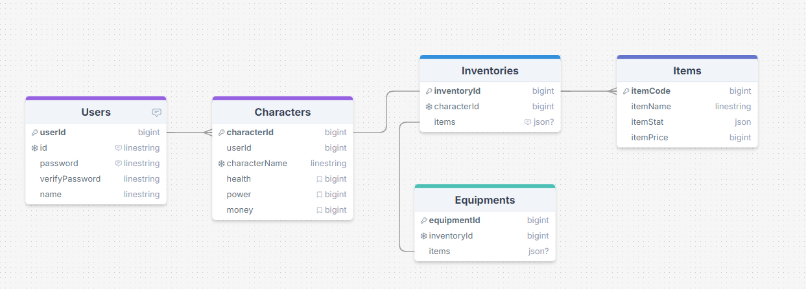
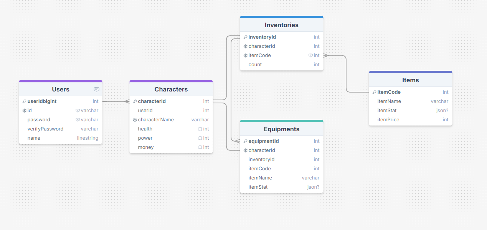

# Item-Simulator

### 프로젝트 간단 소개

Item-Simulator의 API서비스를 구현해보는 프로젝트입니다.

**아이템 시뮬레이터란?**

간단하게 게임 클라이언트 말고, 시뮬레이션으로 현재 나의 게임 아이템 상황 및 다른 사람들의 게임 아이템 상황을 보면서 비교할 수 있고, 어떤 아이템을 갖추면 좋을지 시뮬레이션을 해볼 수 있는 정보를 제공하는 서비스 입니다.

#### 개발기간

2024-09-11 ~ 2024-09-12 필수기능구현
2024-09-12 ~ 도전기능 구현 중

#### 구현기능

- 회원가입 API
- 로그인 API
- 캐릭터 생성 API
- 캐릭터 삭제 API
- 캐릭터 상세 조회 API
- 아이템 생성 API
- 아이템 수정 API
- 아이템 목록 조회 API
- 아이템 상세 조회 API

현재 필수기능까지 구현해 보았습니다.

**ERD**
// 기존 ERD

// 수정된 ERD

스키마를 ERD에 맞게 생성하였습니다.

**API 명세서**

https://diagnostic-blob-8a4.notion.site/Item-Simulator-14189e52ab4b41449e5486bb6e8064f8

#### 질문과 답변 (README.md 파일에 추가)

1. **암호화 방식**

- 비밀번호를 DB에 저장할 때 Hash를 이용했는데, Hash는 단방향 암호화와 양방향 암호화 중 어떤 암호화 방식에 해당할까요?

  - 답: 단방향 암호화 입니다.

- 비밀번호를 그냥 저장하지 않고 Hash 한 값을 저장 했을 때의 좋은 점은 무엇인가요?

  - 답: 비밀번호를 그냥 저장하게 되면 악의적인 해커가 비밀번호를 탈취해 악용할 수 있습니다. 그래서 단방향 암호화를 하여 해커가 비밀번호를 알 수 없게 보안을 더욱 강화할 수 있습니다.

2. **인증 방식**

- JWT(Json Web Token)을 이용해 인증 기능을 했는데, 만약 Access Token이 노출되었을 경우 발생할 수 있는 문제점은 무엇일까요?

  - 답: 노출이 되었을때 실제 본인이 아닌 다른 사람이 이 계정의 권한을 이용해 민감한 정보를 탈취한다던가 정보를 교체하거나, 해당 권한이 필요한 서비스들을 막 이용할 수 있습니다. 예) 비트코인 채굴같은 것들이 있을거 같습니다.

- 해당 문제점을 보완하기 위한 방법으로는 어떤 것이 있을까요?

  - 답: 아 Refresh Token을 이용하는 방법이 있습니다. Refresh Token을 생성해 만료 기한을 Access Token토큰보다 길게 가져가고 Access Token은 만료기한을 짧게 설정합니다. 그리고 Access Token이 만료되면 Refresh Token을 이용해 실제 인증에 필요한 Access Token을 발급하여, Access Token의 노출 시간을 줄일 수 있습니다.

3. **인증과 인가**

- 인증과 인가가 무엇인지 각각 설명해 주세요.

  - 답:

  인증이란 : 서비스를 이용하려는 사용자가 인증된 신분(권한)을 가진 사람이 맞는지 검증하는 작업입니다.

  인가란 : 이미 인증된 사용자가 특정 리소스에 접근하거나 특정 작업을 수행할 수 있는 권한이 있는지를 검증하는 작업을 뜻합니다

- 위 API 구현 명세에서 인증을 필요로 하는 API와 그렇지 않은 API의 차이가 뭐라고 생각하시나요?

  - 답: 실제 이 서비스에서 회원가입이 된 고객인지 판별하는 것과 같다고 생각합니다. 실제 로그인한 사용자이면 이 서비스를 이용할 권한이 있을 것입니다. 마치 비유하자면 코스트코 회원권이 있어 입장이 가능한 것 처럼, 또는 코스트코 회원권이 없으면 입장이 불가능한 것 같은 거라고 생각합니다.

- 아이템 생성, 수정 API는 인증을 필요로 하지 않는다고 했지만 사실은 어느 API보다도 인증이 필요한 API입니다. 왜 그럴까요?

  - 답: 제대로된 인증을 하지 않으면 임의로 다른 사용자가 자신이 필요한 stat을 가진 아이템을 생성, 수정하여 게임 밸런스 망칠 수 있을 것 같습니다.

4. **Http Status Code**

- 과제를 진행하면서 사용한 Http Status Code를 모두 나열하고, 각각이 의미하는 것과 어떤 상황에 사용했는지 작성해 주세요.
  - 200 : 클라이언트 요청을 서버가 정상적으로 처리, get 실행에 성공했을때 사용합니다.
  - 201 : 클라이언트의 요청을 서버가 정상적으로 처리했고 새로운 리소스가 생김, 생성에 성공했을때 사용합니다.
  - 400 : 클라이언트가 잘못된 요청을 보냄을 의미, 요청을 제대로 주지 않아 해당값을 찾지 못할때 사용합니다.
  - 401 : 요청자는 인증(authentication) 되지 않아 수행할 수 없음을 표현, 로그인시 비밀번호가 일치해야될 값이 불일치할때 할때 사용합니다.
  - 404 : 클라이언트가 요청한 자원이 존재하지 않음을 의미, 실제 요청한 값을 이용해 DB에서 해당하는 값을 찾지 못할떄 이용합니다.
  - 409 : 클라이언트의 요청이 서버의 상태와 충돌이 발생, 데이터를 생성하려 할때 이미 생성된 데이터가 있을때 사용합니다.
  - 500 : 서버 내부 문제 발생, 여러 서버의 알수없는 오류 상황을 나타낼때 사용합니다.

5. **게임 경제**

- 현재는 간편한 구현을 위해 캐릭터 테이블에 money라는 게임 머니 컬럼만 추가하였습니다.
- 이렇게 되었을 때 어떠한 단점이 있을 수 있을까요?

  - 답: 음 게임 화폐를 다룰 일이 많아지면 관리하기 복잡해 질 수 있을것 같습니다.

- 이렇게 하지 않고 다르게 구현할 수 있는 방법은 어떤 것이 있을까요?

  - 답: 방법은 아마 따로 화폐를 다루는 테이블을 만들어 이용할 것 같습니다. 화폐가오고간 흔적도 저장하여 화폐 추적이 가능할 수 있게끔 만들어 이상이 생길때 이전의 화폐상태로 되돌리게끔 할 것 같습니다.

- 아이템 구입 시에 가격을 클라이언트에서 입력하게 하면 어떠한 문제점이 있을 수 있을까요?

  - 답: 따로 서버에서 관리하지 않고 바로 클라이언트에서 입력하면 보안에 문제가 생길 것 같습니다.
    악의적인 해커가 클라이언트 데이터에서 아이템 가격을 수정하여 게임 밸런스를 망칠 수 있고, 클라이언트의 일부 저장 데이터가 사라지면 여태까지 플레이어가 벌어둔 화폐가 사라지거나 이상한 값을 도출할 수 있을 것 같습니다.

어려웠던 점

테이블 모델링하는데 있어 감이 좀 안잡혔던거 같습니다. 인벤토리 테이블이랑 장비창 테이블두개가 어떤 테이블과 관계를 맺어야 되는건가에서 어려웠습니다. 실제 제가 구현한 테이블 모델링들이 맞게끔 설정한 것인지 헷갈리는 것 같습니다.

그리고 도전기능까지 해보지 못해 아쉬움이 있지만 다음부턴 계획을 잘세워 커리큘럼에 맞게 따라할 수 있게 해야될 것 같습니다.

그래도 필수기능을 구현하면서 직접 router도 다루어 보고, 여러 오류 사항들도 경험해보면서 API에 대해 조금은 감이 잡혔던 시간이었던거 같습니다. 감사합니다.
